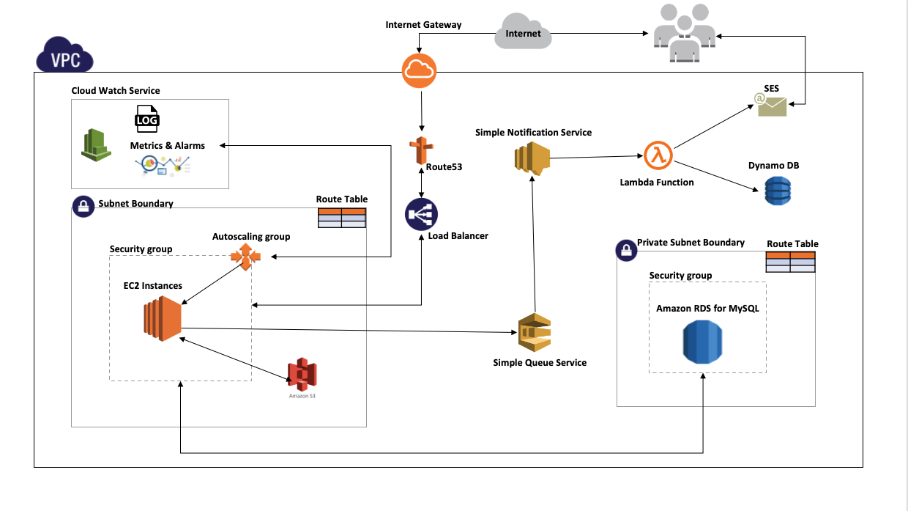

# AWS-CloudComputing

## Deploying a web application on AWS-EC2

**Application Use Cases:**

* Application manages Billing invoices for the customer
* Users and Bills records are saved in MySQL RDS Instance
* Bill related files are uploaded to Amazon S3 bucket with lifecycle policy of 30 days
* Bill file metadata is stored in RDS Instance itself for retrieval purpose
* User receives his due bills in email via AWS Simple email service

**Tools and Technologies**

  <table>
    <thead>
      <tr>
        <th>Category</th>
        <th>AWS Services & Technologies</th>
      </tr>
    </thead>
    <tbody>
        <tr>
            <td>Web Application</td>
            <td>NodeJS, MySQL, Sequelize ORM, Express, Shell Scripts, AWS-SDK, ES6</td>
        </tr>
        <tr>
            <td>Infrastructure</td>
            <td>VPC, ELB, ASG, RDS, Lambda, DynamoDB, Route53, Cloud formation</td>
        </tr>
         <tr>
            <td>Metrics & Logging Service</td>
            <td>statsD, AWS Cloud-Watch, Log4js, Cloud-Watch Alarm </td>
        </tr>
         <tr>
            <td>Queue & Notification Mechanism</td>
            <td>SQS, SNS, Lambda, SES, </td>
        </tr>
          <tr>
            <td>CI/CD Pipeline</td>
            <td>Circle CI, AWS Code Deploy, AMI Automation</td>
        </tr>
       <tr>
            <td>Security</td>
            <td>SSL/TLS , RDS Encryption</td>
        </tr>
    </tbody>
  </table>
  

## Architecture Design

## Infrastructure Preparation

* created custom VPC with network setup using cloud formation template
* Attached Load balancers, auto scaling groups, SES, SQS and SNS services
* Created necessary service roles and policies for AWS resources
* Implemented Lambda function for emailing service 

## CI/CD Pipeline - AMI 

* Automated AMI creation using Hashicorp packer
* Created AMI template to share the image between multiple AWS accounts
* Created golden images by adding provisioners to boostrap instances with - NPM, Code deploy and Cloud watch agaent
